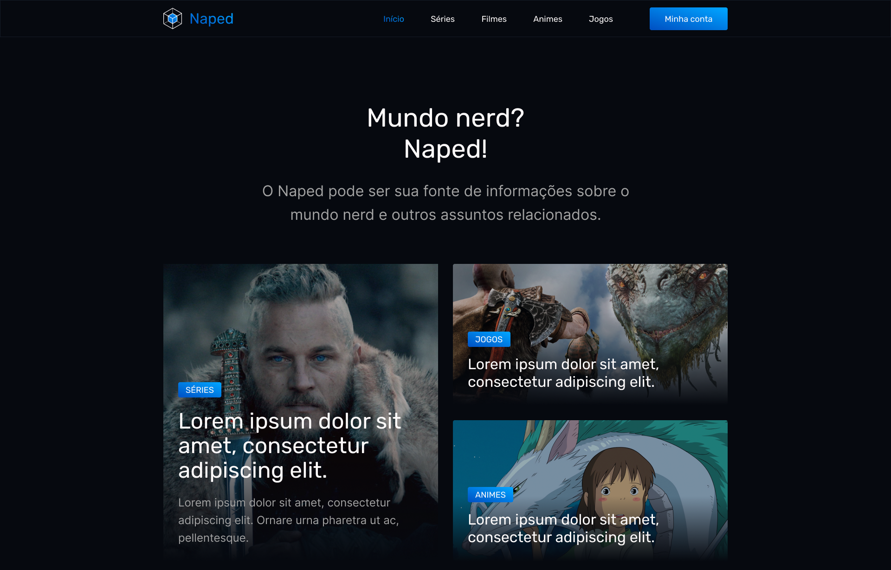

<h1 align="center">
  📰 Naped
</h1>

<h4 align="center"><a href="https://efront-naped.vercel.app/">Clique para visitar o projeto</a></h4>

---

<h2>Tecnologias utilizadas</h2>

Para o desenvolvimento deste site utilizei as seguintes tecnologias:

- Next.js;
- TypeScript;
- styled-components;
- Axios;
- JSON Server;

---

<h2>Autor</h2>

<table>
  <tr>
    <td align="center">
      <a href="https://github.com/iuricode">
         
        
          <b>Iuri Silva</b>
        
      </a>
    </td>
  </tr>
</table>
